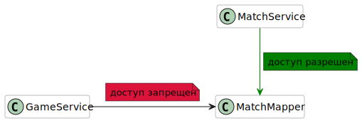
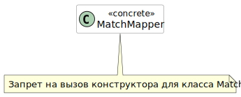
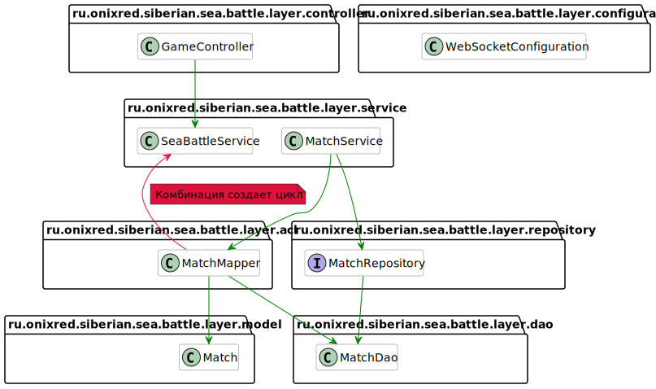
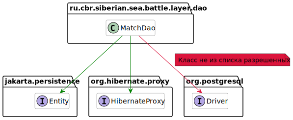
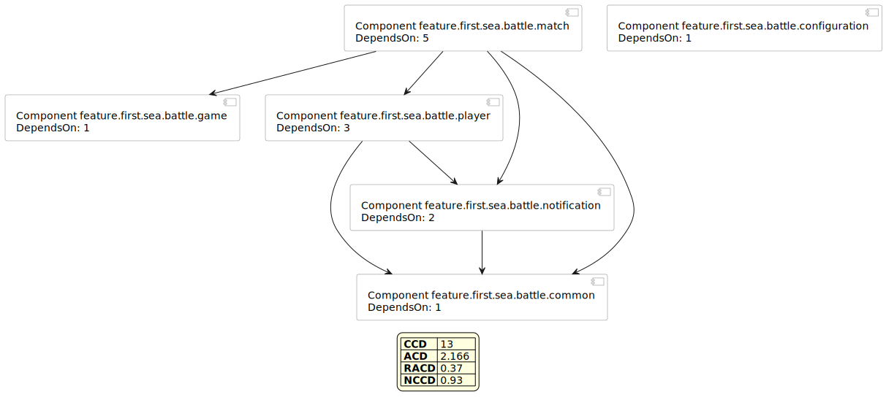
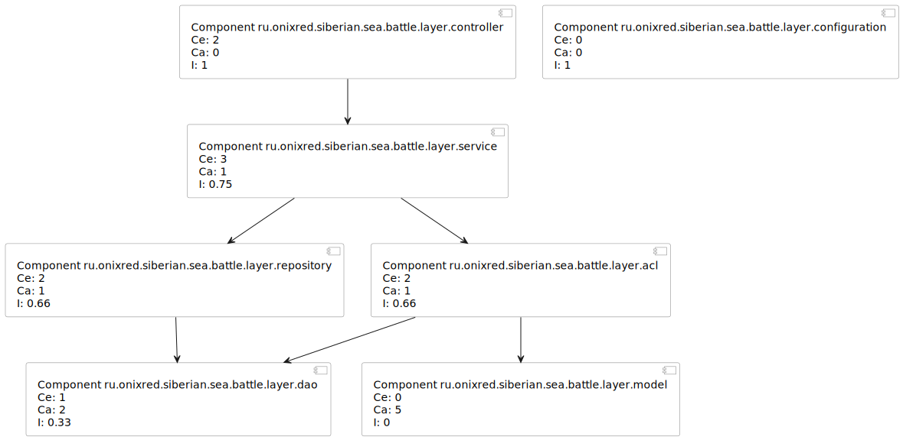
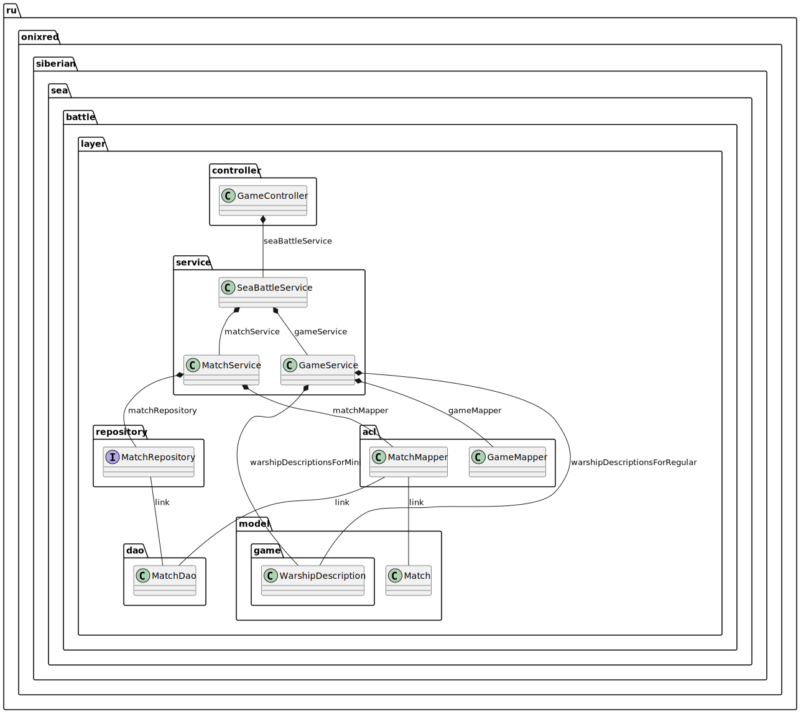
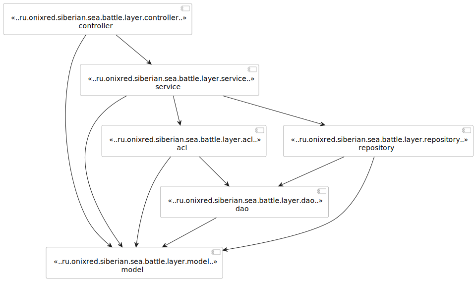

Regular **Markdown** here.

<div hidden>

```
@startuml aclPackageNoDependencyTest
skinparam componentStyle uml2
skinparam component {
BorderColor #grey
BackgroundColor #white
}
[acl] --[#green]right-->  [model]
note left on link #green: доступ разрешен
[acl] --[#green]left-->  [dao]
note left on link #green: доступ разрешен
[acl] --[#crimson]-->  [configuration]
note top on link #crimson: доступ запрещен
[acl] --[#crimson]-->  [controller]
note top on link #crimson: доступ запрещен
[acl] --[#crimson]-->  [repository]
note top on link #crimson: доступ запрещен
[acl] --[#crimson]-->  [service]
note top on link #crimson: доступ запрещен
@enduml
```


```
@startuml aclPackageDependencyTest
skinparam componentStyle uml2
skinparam component {
BorderColor #grey
BackgroundColor #white
}

[acl] --[#green]right-->  [model]
note left on link #green: доступ разрешен
[acl] --[#green]right-->  [dao]
note left on link #green: доступ разрешен
[acl] --[#crimson]left--> [service]
note top on link #crimson: доступ запрещен
@enduml
```

```
@startuml aclPackageHaveDependencyTest
skinparam componentStyle uml2
skinparam component {
BorderColor #grey
BackgroundColor #white
}

[service] --[#green]right-->  [acl]
note left on link #green: доступ разрешен
[model]
@enduml
```

```
@startuml aclPackageHaveNoDependencyTest
skinparam componentStyle uml2
skinparam component {
BorderColor #grey
BackgroundColor #white
}

[service] --[#green]right-->  [acl]
note left on link #green: доступ разрешен
[configuration]
[controller]
[dao]
[model]
[repository]

@enduml
```

```
@startuml matchMapperClassDependencyTest
hide empty members
skinparam componentStyle uml2

skinparam component {
  BorderColor #grey
  BackgroundColor #white
}

skinparam class {
  BorderColor #grey
  BackgroundColor #white
}

class GameService
class MatchMapper

GameService -> MatchMapper
note top on link #crimson: доступ запрещен

MatchService --> MatchMapper #green
note left on link #green: доступ разрешен
@enduml
```

```
@startuml gameMapperClassDependencyTest
hide empty members
set separator none
skinparam componentStyle uml2

skinparam component {
BorderColor #grey
BackgroundColor #white
}

skinparam class {
BorderColor #grey
BackgroundColor #white
}

package ru.onixred.siberian.sea.battle.layer.acl {
class MatchMapper
class GameMapper
}

package ru.onixred.siberian.sea.battle.layer.service {
class MatchService
}

note "находится в пакете 'service'" as ServicePackage #crimson
MatchService .. ServicePackage
@enduml
```

```
@startuml shouldFollowNamingConventionTest
hide empty members
set separator none
skinparam componentStyle uml2

skinparam component {
BorderColor #grey
BackgroundColor #white
}

skinparam class {
BorderColor #grey
BackgroundColor #white
}

package ru.onixred.siberian.sea.battle.layer.acl {
class MatchMapper
class GameMapper
class AclService
}

note "Неправильное имя у класса" as ServicePackage #crimson
AclService .. ServicePackage


@enduml
```

```
@startuml implementBaseRequestMessageTest
hide empty members
skinparam componentStyle uml2

skinparam component {
  BorderColor #grey
  BackgroundColor #white
}

skinparam class {
  BorderColor #grey
  BackgroundColor #white
}

class BaseRequestMessage <<interface>>
class CreateGameRequestMessage <<concrete>>
class CreateUserRequestMessage <<concrete>>
class ChatRequest <<concrete>>

CreateGameRequestMessage ..|> BaseRequestMessage #green
CreateUserRequestMessage ..|> BaseRequestMessage #green
ChatRequest ..|> BaseRequestMessage #crimson

note right on link #crimson: Неправильное имя у класса
@enduml
```

```
@startuml annotationBaseRequestMessageTest
hide empty members
skinparam componentStyle uml2

skinparam component {
  BorderColor #grey
  BackgroundColor #white
}

skinparam class {
  BorderColor #grey
  BackgroundColor #white
}

class BaseRequestMessage <<interface>>
class CreateGameRequestMessage <<concrete>> {
{field} -userId : String 
}
note right of CreateGameRequestMessage::userId
  поле помечено аннотацией NotBlank
end note
  
class CreateUserRequestMessage <<concrete>> {
{field} -username : String
}
note left of CreateUserRequestMessage::username
  поле помечено аннотацией NotBlank
end note

CreateGameRequestMessage ..|> BaseRequestMessage #green
CreateUserRequestMessage ..|> BaseRequestMessage #green

@enduml
```

```
@startuml shouldNotUseFieldInjectionTest
hide empty members
skinparam componentStyle uml2

skinparam component {
  BorderColor #grey
  BackgroundColor #white
}

skinparam class {
  BorderColor #grey
  BackgroundColor #white
}

class GameController <<concrete>> {
{field} -matchService : MatchService
}
note right of GameController::matchService
  поле не помечено аннотацией Autowired
end note

class MatchService <<concrete>> {

}

GameController --> MatchService #green


@enduml
```

```
@startuml shouldNotCreateMatchInMatchMapperTest
hide empty members
skinparam componentStyle uml2

skinparam component {
  BorderColor #grey
  BackgroundColor #white
}

skinparam class {
  BorderColor #grey
  BackgroundColor #white
}

class MatchMapper <<concrete>> {
}
note "Запрет на вызов конструктора для класса Match" as creteMatch 
MatchMapper .. creteMatch

@enduml
```

```
@startuml layeredTest
hide empty members
set separator none
skinparam componentStyle uml2

skinparam component {
  BorderColor #grey
  BackgroundColor #white
}

skinparam class {
  BorderColor #grey
  BackgroundColor #white
}

package ru.onixred.siberian.sea.battle.layer.configuration {
    class WebSocketConfiguration
}

package ru.onixred.siberian.sea.battle.layer.acl {
    class MatchMapper

}

package ru.onixred.siberian.sea.battle.layer.controller {
    class GameController
}

package ru.onixred.siberian.sea.battle.layer.repository {
    interface MatchRepository
}

package ru.onixred.siberian.sea.battle.layer.service {
    class MatchService
    class SeaBattleService
}

GameController -down-> SeaBattleService #green

MatchService -down-> MatchMapper #green
MatchService -down-> MatchRepository #green


GameController -up-> MatchRepository #crimson
note right on link #crimson: Доступ в обход слоя запрещен

MatchService -up--> GameController #crimson
note right on link #crimson: Доступ в верхний слой запрещен


@enduml
```

```
@startuml beFreeOfCyclesTest
hide empty members
set separator none
skinparam componentStyle uml2

skinparam component {
  BorderColor #grey
  BackgroundColor #white
}

skinparam class {
  BorderColor #grey
  BackgroundColor #white
}

package ru.onixred.siberian.sea.battle.layer.acl {
    class MatchMapper
}

package ru.onixred.siberian.sea.battle.layer.configuration {
    class WebSocketConfiguration
}

package ru.onixred.siberian.sea.battle.layer.controller {
    class GameController
}

package ru.onixred.siberian.sea.battle.layer.dao {
    class MatchDao
}

package ru.onixred.siberian.sea.battle.layer.model {
    class Match
}

package ru.onixred.siberian.sea.battle.layer.repository {
    interface MatchRepository
}

package ru.onixred.siberian.sea.battle.layer.service {
    class MatchService
    class SeaBattleService
}

GameController -down-> SeaBattleService #green

MatchService -down-> MatchMapper #green
MatchService -down-> MatchRepository #green
MatchRepository -down-> MatchDao #green
MatchMapper -down-> MatchDao #green
MatchMapper -down-> Match #green
MatchMapper --> SeaBattleService #crimson
note right on link #crimson: Комбинация создает цикл

@enduml
```


```
@startuml onlyAllowedDependenciesInServicePackageTest
hide empty members
set separator none
skinparam componentStyle uml2

skinparam component {
  BorderColor #grey
  BackgroundColor #white
}

skinparam class {
  BorderColor #grey
  BackgroundColor #white
}

package ru.onixred.siberian.sea.battle.layer.acl {
    class MatchMapper
}

package ru.onixred.siberian.sea.battle.layer.configuration {
    class WebSocketConfiguration
}

package ru.onixred.siberian.sea.battle.layer.controller {
    class GameController
}

package ru.onixred.siberian.sea.battle.layer.dao {
    class MatchDao
}

package ru.onixred.siberian.sea.battle.layer.model {
    class Match
}

package ru.onixred.siberian.sea.battle.layer.repository {
    interface MatchRepository
}

package ru.onixred.siberian.sea.battle.layer.service {
    class MatchService
    class SeaBattleService
}

GameController -down-> SeaBattleService #green

MatchService -down-> MatchMapper #green
MatchService -down-> MatchRepository #green
MatchRepository -down-> MatchDao #green
MatchMapper -down-> MatchDao #green
MatchMapper -down-> Match #green
MatchMapper --> SeaBattleService #crimson
note right on link #crimson: Комбинация создает цикл

@enduml
```


```
@startuml lakosMetricsTest
skinparam componentStyle uml2
skinparam component {
  BorderColor #grey
  BackgroundColor #white
}
skinparam legend {
  BackgroundColor #lightyellow
}

[Component ru.onixred.siberian.sea.battle.layer.acl\nDependsOn: 3] as acl
[Component ru.onixred.siberian.sea.battle.layer.configuration\nDependsOn: 1] as configuration
[Component ru.onixred.siberian.sea.battle.layer.controller\nDependsOn: 7] as controller
[Component ru.onixred.siberian.sea.battle.layer.dao\nDependsOn: 1] as dao
[Component ru.onixred.siberian.sea.battle.layer.model\nDependsOn: 1] as model
[Component ru.onixred.siberian.sea.battle.layer.repository\nDependsOn: 2] as repository
[Component ru.onixred.siberian.sea.battle.layer.service\nDependsOn: 6] as service


controller --> service
service --> acl
service --> repository
repository --> dao
acl --> dao
acl --> model

legend
| <b>CCD</b>  | 21   |
| <b>ACD</b>  | 3  |
| <b>RACD</b> | 0.42  |
| <b>NCCD</b> | 1.235 |
endlegend

@enduml
```

```
@startuml lakosMetricsFeatureFirstTest
skinparam componentStyle uml2
skinparam component {
  BorderColor #grey
  BackgroundColor #white
}
skinparam legend {
  BackgroundColor #lightyellow
}

[Component feature.first.sea.battle.game \nDependsOn: 1] as game
[Component feature.first.sea.battle.match \nDependsOn: 5] as match
[Component feature.first.sea.battle.player \nDependsOn: 3] as player
[Component feature.first.sea.battle.common \nDependsOn: 1] as common
[Component feature.first.sea.battle.configuration \nDependsOn: 1] as configuration
[Component feature.first.sea.battle.notification \nDependsOn: 2] as notification


notification --> common

match --> common
match --> player
match --> game
match --> notification

player --> common
player --> notification


legend
| <b>CCD</b>  | 13   |
| <b>ACD</b>  | 2.166  |
| <b>RACD</b> | 0.37  |
| <b>NCCD</b> | 0.93 |
endlegend

@enduml
```


```
@startuml componentDependencyMetricsTest
skinparam componentStyle uml2
skinparam component {
  BorderColor #grey
  BackgroundColor #white
}
skinparam legend {
  BackgroundColor #lightyellow
}

[Component ru.onixred.siberian.sea.battle.layer.acl \nCe: 2\nCa: 1\nI: 0.66] as acl
[Component ru.onixred.siberian.sea.battle.layer.configuration \nCe: 0\nCa: 0\nI: 1] as configuration
[Component ru.onixred.siberian.sea.battle.layer.controller \nCe: 2\nCa: 0\nI: 1] as controller
[Component ru.onixred.siberian.sea.battle.layer.dao \nCe: 1\nCa: 2\nI: 0.33] as dao
[Component ru.onixred.siberian.sea.battle.layer.model \nCe: 0\nCa: 5\nI: 0] as model
[Component ru.onixred.siberian.sea.battle.layer.repository \nCe: 2\nCa: 1\nI: 0.66] as repository
[Component ru.onixred.siberian.sea.battle.layer.service \nCe: 3\nCa: 1\nI: 0.75] as service


controller --> service
service --> acl
service --> repository
repository --> dao
acl --> dao
acl --> model

@enduml
```

```
@startuml componentDependencyMetricsFeatureFirstTest
skinparam componentStyle uml2
skinparam component {
  BorderColor #grey
  BackgroundColor #white
}
skinparam legend {
  BackgroundColor #lightyellow
}


[Component ru.onixred.siberian.sea.battle.feature.game \nCe: 0\nCa: 1\nI: 0] as game
[Component ru.onixred.siberian.sea.battle.feature.match \nCe: 4\nCa: 0\nI:1] as match
[Component ru.onixred.siberian.sea.battle.feature.player \nCe: 2\nCa: 1\nI: 0.66] as player
[Component ru.onixred.siberian.sea.battle.feature.common \nCe: 0\nCa: 3\nI: 0] as common
[Component ru.onixred.siberian.sea.battle.feature.configuration \nCe: 0\nCa: 0\nI: 1] as configuration
[Component ru.onixred.siberian.sea.battle.feature.notification \nCe: 1\nCa: 2\nI: 0.33] as notification


notification --> common

match --> common
match --> player
match --> game
match --> notification

player --> common
player --> notification

@enduml
```

```
@startuml annotationPreAuthorizeTest
hide empty members
skinparam componentStyle uml2

skinparam component {
  BorderColor #grey
  BackgroundColor #white
}

skinparam class {
  BorderColor #grey
  BackgroundColor #white
}

class GameController <<concrete>> {
void : createUser() 
}
note right of GameController::createUser()
  метод помечен аннотацией PreAuthorize
end note

@enduml
```


```
@startuml uml

interface ru.onixred.siberian.sea.battle.layer.repository.MatchRepository {
}

ru.onixred.siberian.sea.battle.layer.controller.GameController *--  ru.onixred.siberian.sea.battle.layer.service.SeaBattleService : seaBattleService
ru.onixred.siberian.sea.battle.layer.service.SeaBattleService *--  ru.onixred.siberian.sea.battle.layer.service.MatchService : matchService
ru.onixred.siberian.sea.battle.layer.service.SeaBattleService *--  ru.onixred.siberian.sea.battle.layer.service.GameService : gameService


ru.onixred.siberian.sea.battle.layer.service.GameService *--  ru.onixred.siberian.sea.battle.layer.model.game.WarshipDescription : warshipDescriptionsForMini
ru.onixred.siberian.sea.battle.layer.service.GameService *--  ru.onixred.siberian.sea.battle.layer.model.game.WarshipDescription : warshipDescriptionsForRegular
ru.onixred.siberian.sea.battle.layer.service.GameService *--  ru.onixred.siberian.sea.battle.layer.acl.GameMapper : gameMapper

ru.onixred.siberian.sea.battle.layer.service.MatchService *--  ru.onixred.siberian.sea.battle.layer.repository.MatchRepository : matchRepository
ru.onixred.siberian.sea.battle.layer.service.MatchService *--  ru.onixred.siberian.sea.battle.layer.acl.MatchMapper : matchMapper
ru.onixred.siberian.sea.battle.layer.acl.MatchMapper -- ru.onixred.siberian.sea.battle.layer.dao.MatchDao: link
ru.onixred.siberian.sea.battle.layer.acl.MatchMapper -- ru.onixred.siberian.sea.battle.layer.model.Match: link
ru.onixred.siberian.sea.battle.layer.repository.MatchRepository --  ru.onixred.siberian.sea.battle.layer.dao.MatchDao : link

@enduml
```


```
@startuml uml_real
skinparam componentStyle uml2
skinparam component {
BorderColor #grey
BackgroundColor #white
}

[controller] <<..ru.onixred.siberian.sea.battle.layer.controller..>>
[dao] <<..ru.onixred.siberian.sea.battle.layer.dao..>>
[model] <<..ru.onixred.siberian.sea.battle.layer.model..>>
[service] <<..ru.onixred.siberian.sea.battle.layer.service..>>
[acl] <<..ru.onixred.siberian.sea.battle.layer.acl..>>
[repository] <<..ru.onixred.siberian.sea.battle.layer.repository..>>

[controller] --> [model]
[controller] --> [service]

[service] --> [model]
[service] --> [acl]
[service] --> [repository]

[dao] --> [model]

[repository] --> [dao]
[repository] --> [model]

[acl] --> [model]
[acl] --> [dao]

@enduml
```
</div>


### Какие есть аналоги

1. JQAssistant - Статический анализатор кода с основанном на Neo4J ()
2. JDepend - Анализатор кода создает отчет качества кода (устарел, прародитель ArchUnit) 
3. Classycle - Инструмент анализа классов и зависимостей (устарел)
4. Degraph - Инструмент для визуализации и тестирования зависимостей классов и пакетов в приложениях (устарел)


### plantuml - это универсальный инструмент, позволяющий быстро и просто создавать широкий спектр диаграмм
 Создаем диаграмму для наглядности 

 ### Проверка от каких пакетов не зависит ACL


```java
JavaClasses javaClasses = new ClassFileImporter()
        .withImportOption(ImportOption.Predefined.DO_NOT_INCLUDE_TESTS)
        .importPackages("ru.onixred.siberian.sea.battle");
ArchRule rule = noClasses().that().resideInAPackage(Layer.ACL.getPackageName())
        .should()
        .dependOnClassesThat()
        .resideInAnyPackage(
                Layer.CONFIGURATION.getPackageName(),
                Layer.CONTROLLER.getPackageName(),
                Layer.REPOSITORY.getPackageName(),
                Layer.SERVICE.getPackageName()
        );

rule.check(javaClasses);
```

### Проверка от каких пакетов зависит ACL


```java
JavaClasses javaClasses = new ClassFileImporter()
        .withImportOption(ImportOption.Predefined.DO_NOT_INCLUDE_TESTS)
        .importPackages("ru.onixred.siberian.sea.battle");
ArchRule rule = classes().that().resideInAPackage(Layer.ACL.getPackageName())
        .should()
        .dependOnClassesThat()
        .resideInAnyPackage(Layer.MODEL.getPackageName(), Layer.DAO.getPackageName());

rule.check(javaClasses);
```

### Проверка кто зависит от пакета ACL

```java
JavaClasses javaClasses = new ClassFileImporter()
        .withImportOption(ImportOption.Predefined.DO_NOT_INCLUDE_TESTS)
        .importPackages("ru.onixred.siberian.sea.battle");
ArchRule rule = classes().that().resideInAPackage(Layer.ACL.getPackageName())
        .should()
        .onlyHaveDependentClassesThat()
        .resideInAnyPackage(
                Layer.SERVICE.getPackageName());

rule.check(javaClasses);
```

### Проверка кто не зависит от пакета ACL

```java
JavaClasses javaClasses = new ClassFileImporter()
        .withImportOption(ImportOption.Predefined.DO_NOT_INCLUDE_TESTS)
        .importPackages("ru.onixred.siberian.sea.battle");
ArchRule rule = noClasses().that().resideInAPackage(Layer.ACL.getPackageName())
        .should()
        .onlyHaveDependentClassesThat()
        .resideInAnyPackage(Layer.CONFIGURATION.getPackageName(),
                Layer.CONTROLLER.getPackageName(),
                Layer.DAO.getPackageName(),
                Layer.MODEL.getPackageName(),
                Layer.REPOSITORY.getPackageName());
        rule.check(javaClasses);
        
        
```

### Проверка кто зависит от класса GameMapper

```java
JavaClasses javaClasses = new ClassFileImporter()
        .withImportOption(ImportOption.Predefined.DO_NOT_INCLUDE_TESTS)
        .importPackages("ru.onixred.siberian.sea.battle");
ArchRule rule = classes().that().haveNameMatching(MatchMapper.class.getName())
        .should()
        .onlyHaveDependentClassesThat().haveNameMatching(MatchService.class.getName());

rule.check(javaClasses);
```


###  Проверка все классы с постфиксом Mapper находятся в пакете ACL

```java
JavaClasses javaClasses = new ClassFileImporter()
        .withImportOption(ImportOption.Predefined.DO_NOT_INCLUDE_TESTS)
        .importPackages("ru.onixred.siberian.sea.battle");

ArchRule rule = classes().that().haveSimpleNameEndingWith("Mapper")
        .should()
        .resideInAPackage(Layer.ACL.getPackageName());

rule.check(javaClasses);
```

###  Проверка в пакете ACL все классы с постфиксом Mapper

```java
JavaClasses javaClasses = new ClassFileImporter()
        .withImportOption(ImportOption.Predefined.DO_NOT_INCLUDE_TESTS)
        .importPackages("ru.onixred.siberian.sea.battle");
ArchRule rule = classes().that()
        .resideInAnyPackage(Layer.ACL.getComponentIdentifier("ru.onixred.siberian.sea.battle"))
        .should()
        .haveSimpleNameEndingWith("Mapper");

rule.check(javaClasses);
```


###  Проверка все классы реализующие интерфейс BaseRequestMessage должны иметь постфикс RequestMessage

```java
JavaClasses javaClasses = new ClassFileImporter()
        .withImportOption(ImportOption.Predefined.DO_NOT_INCLUDE_TESTS)
        .importPackages("ru.onixred.siberian.sea.battle");
ArchRule rule = classes().that().implement(BaseRequestMessage.class)
        .should().haveSimpleNameEndingWith("RequestMessage");

rule.check(javaClasses);
```

###  Проверка все поля классов реализующие интерфейс BaseRequestMessage используют аннотации проверки NotBlank или NotNull

```java
JavaClasses javaClasses = new ClassFileImporter()
        .withImportOption(ImportOption.Predefined.DO_NOT_INCLUDE_TESTS)
        .importPackages("ru.onixred.siberian.sea.battle");
ArchRule rule = classes().that().areAssignableTo(BaseRequestMessage.class)
        .should().onlyAccessFieldsThat(are(annotatedWith(NotBlank.class))
        .or(annotatedWith(NotNull.class)));

rule.check(javaClasses);
```


###  Проверка на наличие аннотаций Autowired у полей класса

```java
JavaClasses javaClasses = new ClassFileImporter()
        .withImportOption(ImportOption.Predefined.DO_NOT_INCLUDE_TESTS)
        .importPackages("ru.onixred.siberian.sea.battle");
ArchRule rule = noFields().should()
        .beAnnotatedWith(Autowired.class);

rule.check(javaClasses);
```

###  Проверка на отсутствие конструктора Match в MatchMapper

```java
JavaClasses javaClasses = new ClassFileImporter()
        .withImportOption(ImportOption.Predefined.DO_NOT_INCLUDE_TESTS)
        .importPackages("ru.onixred.siberian.sea.battle");
ArchRule rule = noConstructors().that().areDeclaredInClassesThat()
        .areAssignableTo(Match.class)
        .should().onlyBeCalled().byClassesThat()
        .haveNameMatching(MatchMapper.class.getName());

rule.check(javaClasses);
```

###  Проверка слоев

```java

JavaClasses javaClasses = new ClassFileImporter()
        .withImportOption(ImportOption.Predefined.DO_NOT_INCLUDE_TESTS)
        .importPackages("ru.onixred.siberian.sea.battle");

Architectures.LayeredArchitecture layeredArchitecture = layeredArchitecture()
        .consideringAllDependencies()
        .layer("acl").definedBy("ru.onixred.siberian.sea.battle.layer.acl..")
        .layer("configuration").definedBy("ru.onixred.siberian.sea.battle.layer.configuration..")
        .layer("controller").definedBy("ru.onixred.siberian.sea.battle.layer.controller..")
        .layer("repository").definedBy("ru.onixred.siberian.sea.battle.layer.repository..")
        .layer("service").definedBy("ru.onixred.siberian.sea.battle.layer.service..")

        .whereLayer("acl").mayOnlyBeAccessedByLayers("service")
        .whereLayer("configuration").mayNotBeAccessedByAnyLayer()
        .whereLayer("controller").mayNotBeAccessedByAnyLayer()
        .whereLayer("repository").mayOnlyBeAccessedByLayers("service")
        .whereLayer("service").mayOnlyBeAccessedByLayers("controller");
layeredArchitecture.check(javaClasses);
```

###  Проверка циклов

```java
JavaClasses javaClasses = new ClassFileImporter()
        .withImportOption(ImportOption.Predefined.DO_NOT_INCLUDE_TESTS)
        .importPackages("ru.onixred.siberian.sea.battle");
SliceRule sliceRule = slices()
        .matching("ru.onixred.siberian.sea.battle.(*)..")
        .should()
        .beFreeOfCycles();
sliceRule.check(javaClasses);
```

### Проверка внешних библиотек

```java
    @Test
    @DisplayName("Классы в пакете DAO не должны напрямую зависеть от 'других' внешних библиотек")
    void onlyAllowedDependenciesInServicePackageTest() {

        JavaClasses javaClasses = new ClassFileImporter()
                .withImportOption(ImportOption.Predefined.DO_NOT_INCLUDE_TESTS)
                .importPackages(IMPORT_PACKAGES);

        ArchRule rule = classes().that()
                .resideInAPackage("ru.onixred.siberian.sea.battle.layer.dao..")
                .should()
                .onlyDependOnClassesThat()
                .resideInAnyPackage("java..",
                        "ru.onixred.siberian..",
                        "lombok..",
                        "jakarta.persistence..",
                        "org.hibernate.proxy.."
                ) // Allowed dependency
                .as("Classes in the DAO package should not depend on external 'other' libraries directly");

        rule.check(javaClasses);
    }
}
```


###  Проверка метрик Джона Лакоса на примере layer-first

```java
JavaClasses javaClasses = new ClassFileImporter()
        .withImportOption(ImportOption.Predefined.DO_NOT_INCLUDE_TESTS)
        .importPackages("ru.onixred.siberian.sea.battle.layer");

Set<JavaPackage> subpackages = javaClasses.getPackage("ru.onixred.siberian.sea.battle.layer")
        .getSubpackages();
MetricsComponents<JavaClass> components = MetricsComponents.fromPackages(subpackages);
LakosMetrics metrics = ArchitectureMetrics.lakosMetrics(components);

assertTrue(metrics.getCumulativeComponentDependency() <= 21, 
        "CCD - Сумма зависимостей всех компонентов " + metrics.getCumulativeComponentDependency());
assertTrue(metrics.getAverageComponentDependency() <= 3, 
        "ACD - CCD деленная на количество всех компонентов " + metrics.getAverageComponentDependency());
```

###  Проверка метрик Джона Лакоса на примере feature-first

```java
JavaClasses javaClasses = new ClassFileImporter()
        .withImportOption(ImportOption.Predefined.DO_NOT_INCLUDE_TESTS)
        .importPackages("ru.onixred.siberian.sea.battle.feature");

Set<JavaPackage> subpackages = javaClasses.getPackage("ru.onixred.siberian.sea.battle.feature")
        .getSubpackages();
MetricsComponents<JavaClass> components = MetricsComponents.fromPackages(subpackages);
LakosMetrics metrics = ArchitectureMetrics.lakosMetrics(components);

assertTrue(metrics.getCumulativeComponentDependency() <= 15, 
        "CCD - Сумма зависимостей всех компонентов " + metrics.getCumulativeComponentDependency());
assertTrue(metrics.getAverageComponentDependency() <= 2.17, 
        "ACD - CCD деленная на количество всех компонентов " + metrics.getAverageComponentDependency());
```


https://habr.com/ru/articles/772802/
###  Проверка метрик Роберта Мартина «Чистая архитектура» на примере layer-first


В структуре компонентов нестабильные компоненты должны располагаться сверху, а более стабильные — снизу,
Чем больше I тем не стабильнее компонент.
```java
JavaClasses javaClasses = new ClassFileImporter()
        .withImportOption(ImportOption.Predefined.DO_NOT_INCLUDE_TESTS)
        .importPackages("ru.onixred.siberian.sea.battle");

Set<JavaPackage> subpackages = javaClasses.getPackage("ru.onixred.siberian.sea.battle")
        .getSubpackages();
MetricsComponents<JavaClass> components = MetricsComponents.fromPackages(subpackages);
ComponentDependencyMetrics metrics = ArchitectureMetrics.componentDependencyMetrics(components);

int efferentCoupling = metrics.getEfferentCoupling("ru.onixred.siberian.sea.battle.layer.acl");
assertTrue(efferentCoupling == 2, 
           "Ce - показывает зависимости пакета от внешних пакетов" + efferentCoupling);
int afferentCoupling = metrics.getAfferentCoupling("ru.onixred.siberian.sea.battle.layer.acl");
assertTrue(afferentCoupling == 1, 
           "Ca - показывает зависимости внешних пакетов от указанного пакета" + afferentCoupling);
double instability = metrics.getInstability("ru.onixred.siberian.sea.battle.layer.acl"));
assertTrue(instability <= 0.7, 
           "I - Ce / (Ca + Ce), (нестабильность)" + instability);
```

###  Проверка метрик Роберта Мартина «Чистая архитектура» на примере feature-first


В структуре компонентов нестабильные компоненты должны располагаться сверху, а более стабильные — снизу,
Чем больше I тем не стабильнее компонент.
```java
JavaClasses javaClasses = new ClassFileImporter()
        .withImportOption(ImportOption.Predefined.DO_NOT_INCLUDE_TESTS)
        .importPackages("ru.onixred.siberian.sea.battle.feature");

Set<JavaPackage> subpackages = javaClasses.getPackage("ru.onixred.siberian.sea.battle.feature")
        .getSubpackages();
MetricsComponents<JavaClass> components = MetricsComponents.fromPackages(subpackages);
ComponentDependencyMetrics metrics = ArchitectureMetrics.componentDependencyMetrics(components);

int efferentCoupling = metrics.getEfferentCoupling(Feature.Game.getComponentIdentifier());
assertTrue(efferentCoupling <= 0, 
           "Ce - показывает зависимости пакета от внешних пакетов" + efferentCoupling);

int afferentCoupling = metrics.getAfferentCoupling(Feature.Game.getComponentIdentifier());
assertTrue(afferentCoupling <= 1, 
           "Ca - показывает зависимости внешних пакетов от указанного пакета" + afferentCoupling);

double instability = metrics.getInstability(Feature.Game.getComponentIdentifier());
assertTrue(instability <= 0, 
           "I - Ce / (Ca + Ce), (нестабильность)" + instability);
```

###  Проверка во всех классах в пакете controller на методах должна стоять аннотация PreAuthorize


В структуре компонентов нестабильные компоненты должны располагаться сверху, а более стабильные — снизу,
Чем больше I тем не стабильнее компонент.
```java
@Test
@DisplayName("Проверка во всех классах в пакете controller на методах должна стоять аннотация PreAuthorize")
void annotationPreAuthorizeTest() {
    String importPackages = "ru.onixred.siberian.sea.battle.layer";
    JavaClasses importedClasses = new ClassFileImporter()
            .withImportOption(ImportOption.Predefined.DO_NOT_INCLUDE_TESTS)
            .importPackages(importPackages);

    ArchRule rule = methods().that().arePublic()
            .and().areDeclaredInClassesThat().resideInAPackage("..controller..")
            .should()
            .beAnnotatedWith(PreAuthorize.class);

    rule.check(importedClasses);
}
```



реальные
```java
JavaClasses javaClasses = new ClassFileImporter()
        .withImportOption(ImportOption.Predefined.DO_NOT_INCLUDE_TESTS)
        .importPackages(IMPORT_PACKAGES);
final var diagram = getClass().getClassLoader().getResource("siberian-sea-battle.puml");
ClassesShouldConjunction conjunction = classes()
        .should(adhereToPlantUmlDiagram(diagram, consideringOnlyDependenciesInDiagram()));

conjunction.check(javaClasses);
```


Пример PlantUml файла

```
@startuml
skinparam componentStyle uml2
skinparam component {
  BorderColor #grey
  BackgroundColor #white
}

[controller] --> [model]
[controller] --> [service]

[service] --> [model]
[service] --> [acl]
[service] --> [repository]

[repository] --> [dao]

[acl] --> [model]
[acl] --> [dao]

@enduml
```

##  Используем бибиотеку 

### Проверка, что все публичные методы в указанном пакете должны использовать указанный список аннотаций  
```java
    public static void execute(String packagePath, String resideInAPackage, Class<? extends Annotation> annotation) {

        JavaClasses importedClasses = new ClassFileImporter()
                .withImportOption(ImportOption.Predefined.DO_NOT_INCLUDE_TESTS)
                .importPackages(packagePath);


        ArchRule rule = ArchRuleDefinition.methods().that().arePublic()
                .and().areDeclaredInClassesThat().resideInAPackage(resideInAPackage)
                .should()
                .beAnnotatedWith(annotation);

        rule.check(importedClasses);
    }
```
### Пример в слое CONTROLLER все публичные методы используют аннотацию @MessageMapping
```java
  @Test
  @DisplayName("Проверка во всех классах в пакете controller на методах должна стоять аннотация MessageMapping")
  void annotationMessageMappingTest() {
      AnnotationsForAllPublicMethodsToClassRuleTest.execute(IMPORT_PACKAGES,
    Layer.CONTROLLER.getPackageName(), MessageMapping.class);
  }
```

### Проверка взаимосвязей между слоями 
```java
public static void execute(String packagePath, Map<ParamLayer, List<ParamLayer>> layerBeAccessedByLayers) {

      JavaClasses importedClasses = new ClassFileImporter()
              .withImportOption(ImportOption.Predefined.DO_NOT_INCLUDE_TESTS)
              .importPackages(packagePath);
      Architectures.LayeredArchitecture layeredArchitecture = Architectures.layeredArchitecture().consideringAllDependencies();
      for(ParamLayer layer: layerBeAccessedByLayers.keySet()) {
          layeredArchitecture = layeredArchitecture.layer(layer.getName()).definedBy(layer.getPackageName());
      }

      for(Map.Entry<ParamLayer, List<ParamLayer>> entry: layerBeAccessedByLayers.entrySet()) {
          List<ParamLayer> layers =  entry.getValue();
          if(layers == null || layers.isEmpty()) {
              layeredArchitecture = layeredArchitecture.whereLayer(entry.getKey().getName()).mayNotBeAccessedByAnyLayer();
          } else {
              String[] names = layers.stream().map(ParamLayer::getName).toList().toArray(new String[0]);
              layeredArchitecture = layeredArchitecture.whereLayer(entry.getKey().getName()).mayOnlyBeAccessedByLayers(names);
          }

      }
      layeredArchitecture.check(importedClasses);

    }
```
### Пример проверки  многослойной архитектуры
```java
    @Test
    @DisplayName("Проверка слоев")
    void layeredTest() {
        Map<ParamLayer, List<ParamLayer>> layerBeAccessedByLayers = Map.of(
                Layer.ACL, List.of(Layer.SERVICE, Layer.MODEL_ENUMERATION),
                Layer.CONFIGURATION, List.of(),
                Layer.CONTROLLER, List.of(),
                Layer.DAO, List.of(Layer.REPOSITORY, Layer.ACL),
                Layer.MODEL, List.of(Layer.SERVICE, Layer.ACL,Layer.DAO, Layer.CONTROLLER, Layer.REPOSITORY),
                Layer.MODEL_ENUMERATION, List.of(Layer.DAO, Layer.MODEL, Layer.MODEL_MESSAGE,
                Layer.REPOSITORY, Layer.SERVICE, Layer.ACL),
                Layer.MODEL_GAME, List.of(Layer.SERVICE, Layer.ACL),
                Layer.MODEL_MESSAGE, List.of(Layer.CONTROLLER, Layer.SERVICE),
                Layer.REPOSITORY, List.of(Layer.SERVICE),
                Layer.SERVICE, List.of(Layer.CONTROLLER));
         LayeredRuleTest.execute(IMPORT_PACKAGES,layerBeAccessedByLayers);
    }
```

### Проверка метрик связности компонентов
```java
 public static void execute(String packagePath, String packageName, List<ComponentMetricLayer> layers) {
      JavaClasses importedClasses = new ClassFileImporter()
              .withImportOption(ImportOption.Predefined.DO_NOT_INCLUDE_TESTS)
              .importPackages(packagePath);
      Set<JavaPackage> subpackages = importedClasses.getPackage(packageName).getSubpackages();
      MetricsComponents<JavaClass> metricsComponents = MetricsComponents.fromPackages(subpackages);

      ComponentDependencyMetrics metrics = ArchitectureMetrics.componentDependencyMetrics(metricsComponents);
      for (ComponentMetricLayer layer : layers) {
          int efferentCoupling = metrics.getEfferentCoupling(layer.getComponentIdentifier());
          int afferentCoupling = metrics.getAfferentCoupling(layer.getComponentIdentifier());
          double instability = metrics.getInstability(layer.getComponentIdentifier());
          ComponentMetric componentMetric = layer.getComponentMetric();

          assertTrue(efferentCoupling <= componentMetric.efferentCoupling(),
String.format("Слой %s Ce - расчет %s  ожидание %s",
                          layer.getPackageName(), efferentCoupling, componentMetric.efferentCoupling()));
          assertTrue(afferentCoupling >= componentMetric.afferentCoupling(),
String.format("Слой %s Ca -  расчет %s  ожидание %s",
                          layer.getPackageName(), afferentCoupling, componentMetric.afferentCoupling()));
          assertTrue(instability <= componentMetric.instability(),
String.format("Слой %s I - Ce / (Ca + Ce) - расчет %s  ожидание %s",
                          layer.getPackageName(), instability, componentMetric.instability()));
      }
  }
```
### Пример проверки метрик связности компонентов
```java
  @Test
  @DisplayName("Проверка метрик связности компонентов")
  void componentDependencyMetricsTest() {
      List<ComponentMetricLayer> layers = List.of(ComponentMetricLayers.values());
      ComponentDependencyMetricsRuleTest.execute(IMPORT_PACKAGES, IMPORT_PACKAGES, layers);
  }

    @Getter
    @RequiredArgsConstructor
    enum ComponentMetricLayers implements ComponentMetricLayer {
        ACL("acl", new ComponentMetric(2,1,0.67)),
        CONFIGURATION("configuration", new ComponentMetric(0,0,1)),
        CONTROLLER("controller", new ComponentMetric(2,0,1)),
        DAO("dao", new ComponentMetric(1,2,0.34)),
        MODEL("model", new ComponentMetric(0,5,0)),
        MODEL_ENUMERATION("model.enumeration", new ComponentMetric(0,0,0)),
        MODEL_GAME("model.game", new ComponentMetric(0,0,0)),
        MODEL_MESSAGE("model.message", new ComponentMetric(0,0,0)),
        REPOSITORY("repository", new ComponentMetric(2,1,0.67)),
        SERVICE("service", new ComponentMetric(3,1,0.75));
         ...
        }
    }
```

### Проверка, что все классы которые в пакете PackageName должны заканчиваются согласно правилу RuleNameEnding

```java
  public static void execute(String packagePath, RuleParamLayer layer) {

      JavaClasses importedClasses = new ClassFileImporter()
              .withImportOption(ImportOption.Predefined.DO_NOT_INCLUDE_TESTS)
              .importPackages(packagePath);

      ArchRule rule = ArchRuleDefinition.classes().that().areNotAnonymousClasses().and()
              .resideInAnyPackage(layer.getPackageName())
              .should()
              .haveNameMatching(layer.getRuleNameEnding());

      rule.check(importedClasses);
    }
```

### Проверка именований классов в пакетах
```java
    @ParameterizedTest
    @DisplayName("Проверка именований классов в пакетах")
    @EnumSource(value = Layer.class)
    void shouldFollowNamingConventionTest(Layer layer) {
            NamingConventionInPackageRuleTest.execute(IMPORT_PACKAGES, layer);
    }

    @Getter
    @RequiredArgsConstructor
    public enum Layer implements ParamLayer, RuleParamLayer {
        ACL("acl",".*Mapper"),
        CONFIGURATION("configuration",".*Configuration"),
        CONTROLLER("controller",".*Controller"),
        DAO("dao",".*Dao"),
        MODEL("model",".*"),
        MODEL_ENUMERATION("model.enumeration",".*Status|.*Type.*"),
        MODEL_GAME("model.game",".*"),
        MODEL_MESSAGE("model.message",".*Message.*|.*MatchUI"),
        REPOSITORY("repository",".*Repository"),
        SERVICE("service",".*Service");
    
        private final String name;
        private final String ruleNameEnding;
    }
```
