### aclPackageDependencyTest
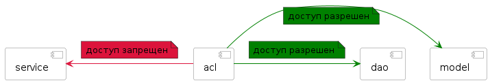

### aclPackageHaveDependencyTest

### aclPackageHaveNoDependencyTest
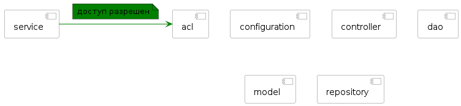

### aclPackageNoDependencyTest
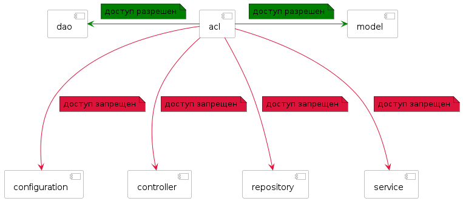

### annotationBaseRequestMessageTest
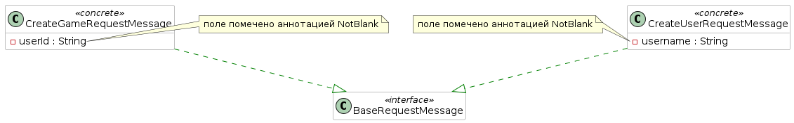

### beFreeOfCyclesTest
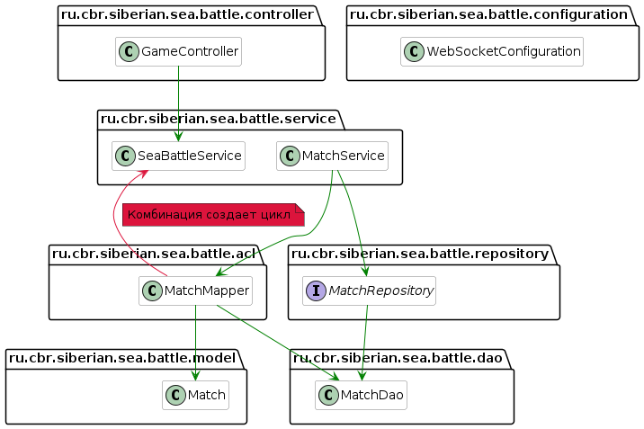

### componentDependencyMetricsFeatureFirstTest
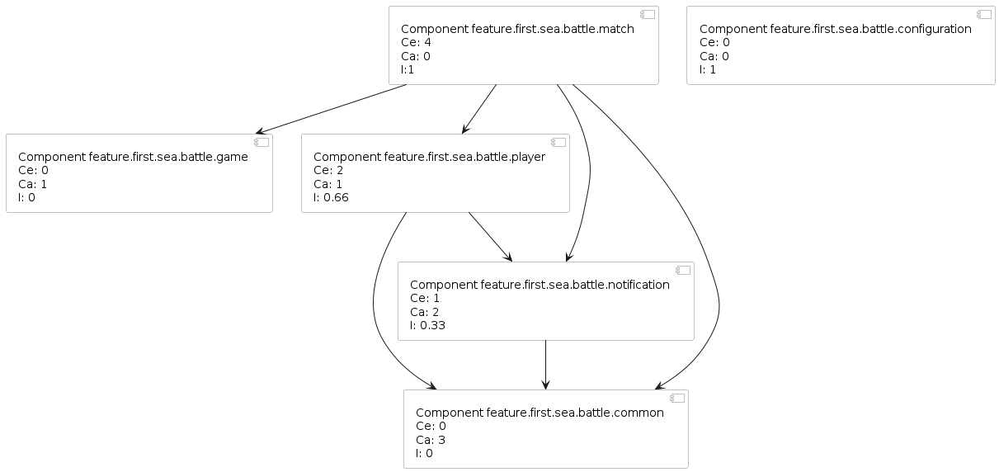

### componentDependencyMetricsTest
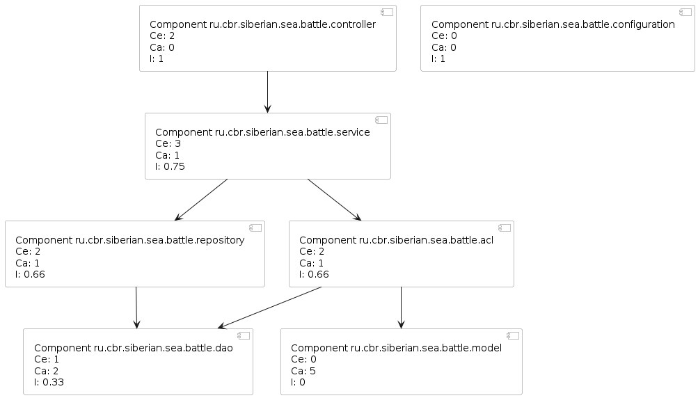

### gameMapperClassDependencyTest
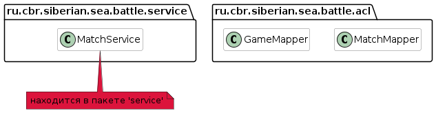

### implementBaseRequestMessageTest
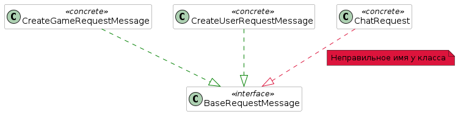

### lakosMetricsFeatureFirstTest
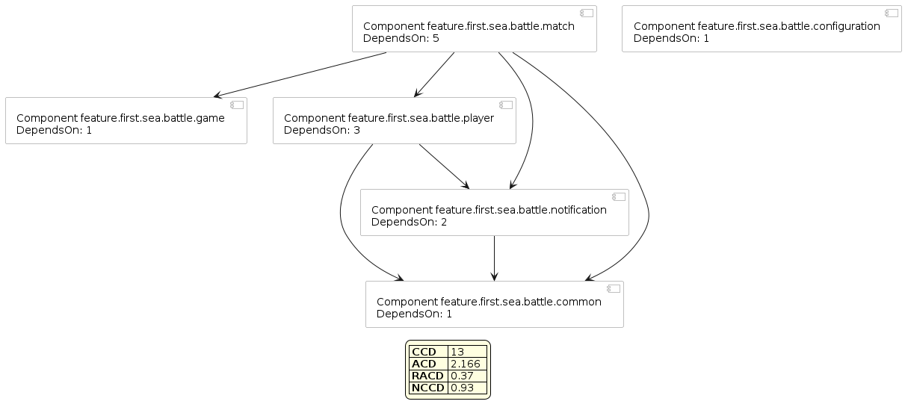

### lakosMetricsTest
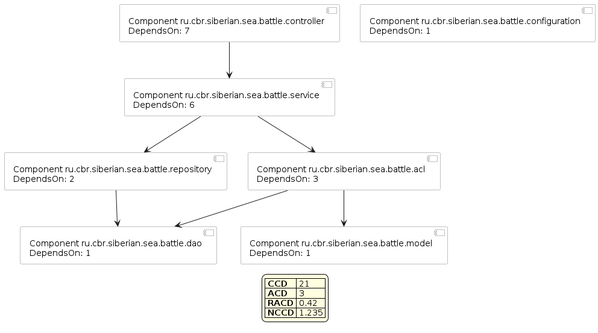

### layeredTest
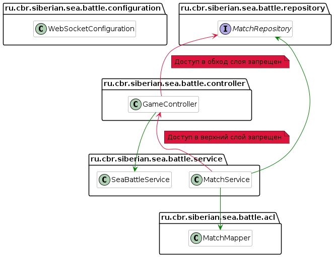

### matchMapperClassDependencyTest
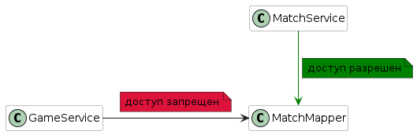

### shouldFollowNamingConventionTest
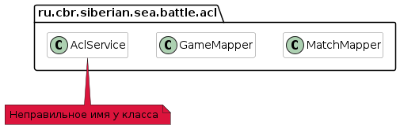

### shouldNotCreateMatchInMatchMapperTest
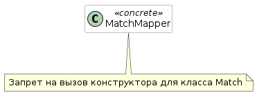

### shouldNotUseFieldInjectionTest
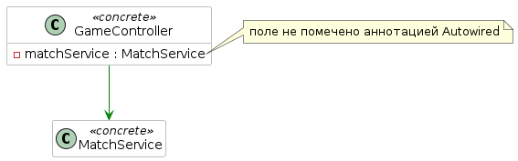

### siberian-sea-battle-class-dependency
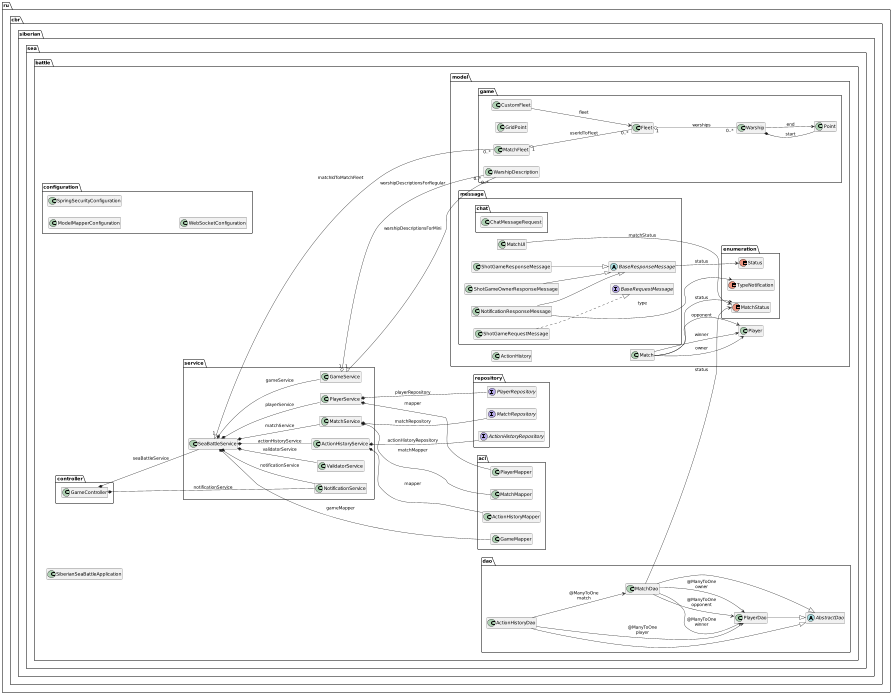

### siberian-sea-battle-class-dependency2
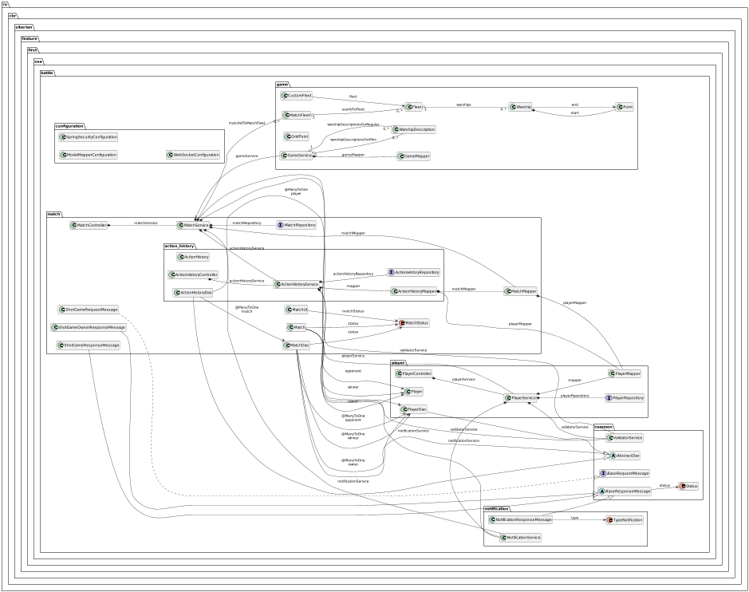

### uml
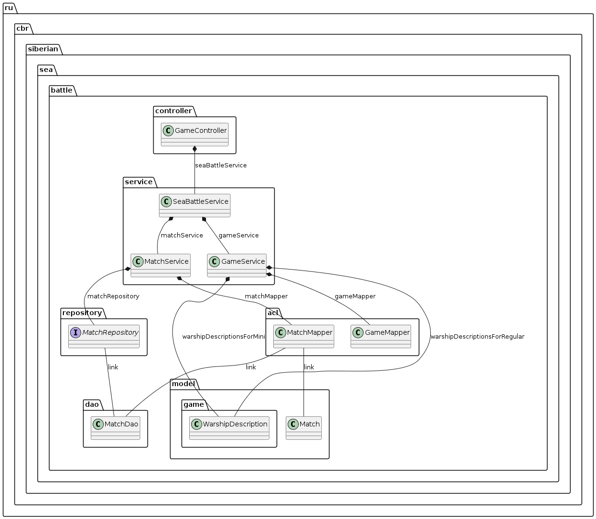

### uml_real
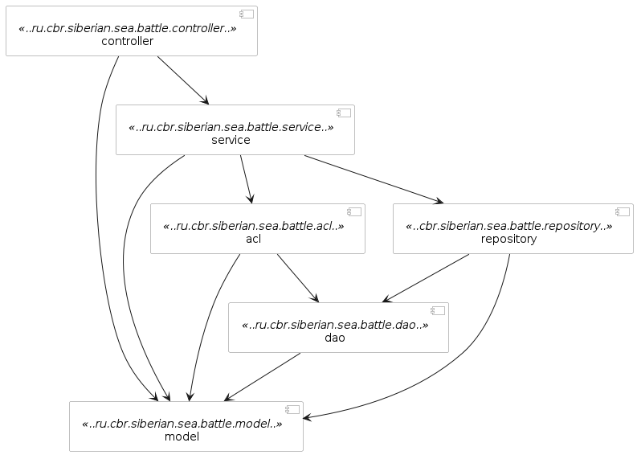

